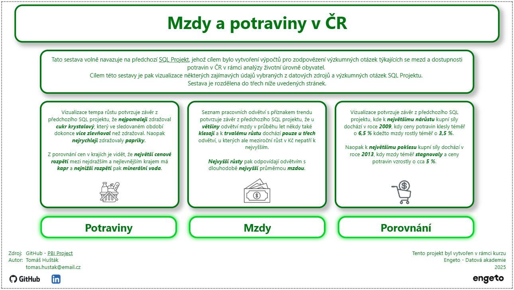
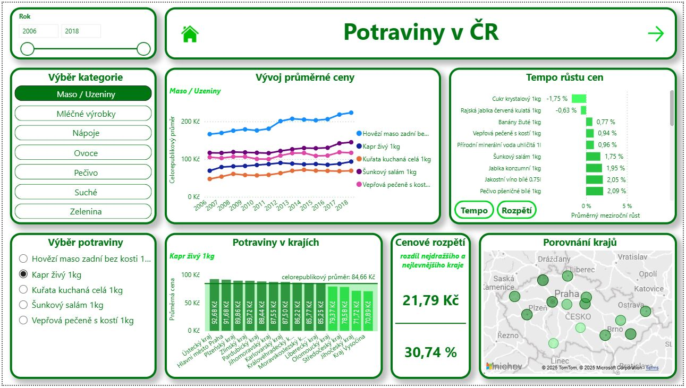
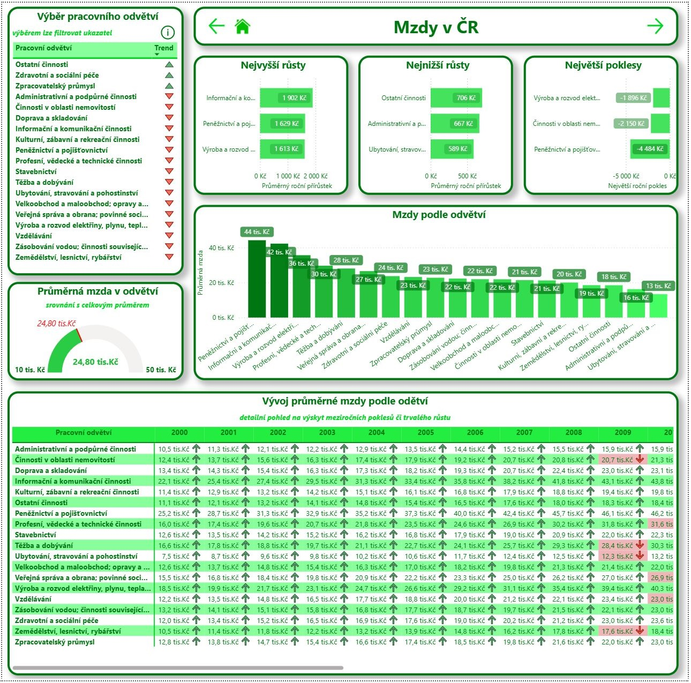
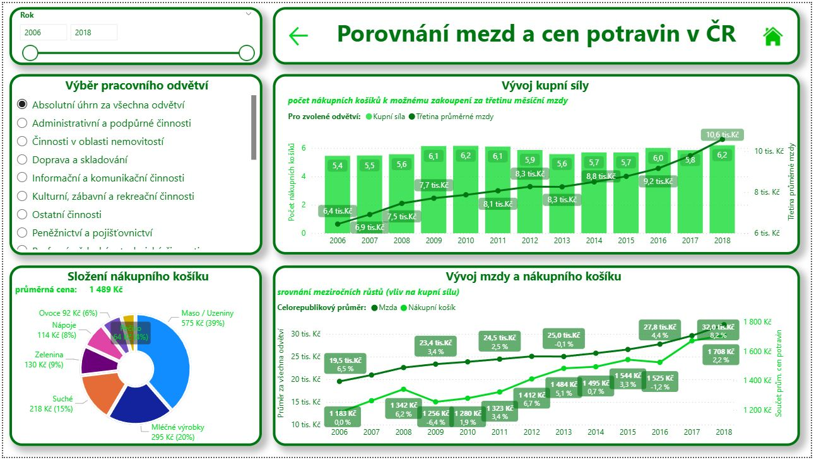

# Průvodní zpráva
> [!NOTE]
> ENGETO - Datová akademie 5.3.2025  
> Power BI Projekt

> 📂 Zdrojové soubory projektu [viz výstupy](#výstupy-projektu)  
> 📄`PBI_Project_Engeto_DA_tomas_hustak.pbix` [viz popis](#2-zdrojové-tabulky-sestavy) / [viz obsah sestavy](#3-obsah-sestavy)  
> 
> > 📂 SQL_Scripts  
>   📄`SQL_Script_Mzdy_Odvetvi.sql` [viz popis](#tabulka-mzdy_odvetvi)  
>   📄`SQL_Script_Potraviny.sql` [viz popis](#tabulka-potraviny)  
>   📄`SQL_Script_Potraviny_Kategorie.sql` [viz popis](#tabulka-potraviny_kategorie)  
>   📄`SQL_Script_Potraviny_Kraje.sql` [viz popis](#tabulka-potraviny_kraje)  
>   📄`SQL_Script_Potraviny_Kosik_CR.sql` [viz popis](#tabulka-potraviny_kosik_cr)  
> 
> > 📂 Screens  
>   *... náhledy jednotlivých stránek Power BI sestavy* [viz obsah sestavy](#3-obsah-sestavy)  

# 1. Zadání projektu

### <ins>Úvod do projektu</ins>
**_Zadání dle výukového portálu kurzu:_**  

V rámci [prvního projektu](https://github.com/tomas-hustak/SQL_Project) Datové akademie máš připravené vhodné datové podklady a zodpovězené několikery výzkumné otázky.  

Druhý projekt je zaměřen na vizualizování datasetu. **Použít můžeš buď svůj vlastní předpřipravený dataset**, případně znovu vycházet z původních datových zdrojů.  

Tentokrát nebudeš hledat odpovědi na výzkumné otázky, ale je zcela na tvém výběru, které ukazatele jsou pro tebe nejzajímavější. Zamysli se, která data jsou pro čtenáře nejzajímavější a ta mu nabídni, včetně vhodné interaktivity.  

Můžeš se tedy samozřejmě **inspirovat otázkami z prvního projektu**, hlavně je ale musíš vhodným způsobem graficky zobrazit v Power BI reportu.  

**Tvým úkolem tedy je vizualizovat tebou zvolený dataset podle níže zadaných kritérií:**
- Rozsah 2-5 stránek
- Použití minimálně 5 různých typů vizuálů
- Filtrování (primárně) pomocí průřezů/slicerů
- Využití interaktivních prvků jako jsou záložky, navigace po stranách, odkazy na webové stránky, ...
- Propojení několika (2+) datových tabulek, buď přes vazby v rámci Power BI nebo přes propojení v Power Query
- Použití vytvořené hierarchie o alespoň dvou úrovních (nepovinné)
- Vytvoření alespoň 1 measure (metrika/míra) a 1 kalkulovaného sloupce/tabulky
- Grafická úprava použitých vizuálů, zvolení správných typů vizuálů a vizuálně přívětivý výsledný report

### <ins>Zdrojové datové sady</ins>
Sestava vytvořená v rámci Power BI projektu volně navazuje na předchozí [SQL Projekt](https://github.com/tomas-hustak/SQL_Project).  
Jejím cílem je vizualizace některých zajímavých údajů vybraných z datových zdrojů a výzkumných otázek SQL Projektu.  

Údaje použité v sestavě byly čerpány z níže uvedených datových zdrojů (cvičných tabulek výukové databáze kurzu Datové akademie).  

**Ze zdrojové výukové databáze byly použity následující tabulky:**
- `czechia_payroll` – Informace o mzdách v různých odvětvích za několikaleté období. Datová sada pochází z Portálu otevřených dat ČR.
- `czechia_payroll_industry_branch` – Číselník odvětví v tabulce mezd.
- `czechia_price` – Informace o cenách vybraných potravin za několikaleté období. Datová sada pochází z Portálu otevřených dat ČR.
- `czechia_price_category` – Číselník kategorií potravin, které se vyskytují v našem přehledu.
- `czechia_region` – Číselník krajů České republiky dle normy CZ-NUTS.

_V rámci použití nebyly samotné tabulky nijak upravovány. Úprava a transformace dat byla provedena až v rámci načtení a importu do Power BI._  

### <ins>Výstupy projektu</ins>
Výstupem má být Power BI sestava uložená v souboru **.pbix** obsahující vizualizace zvoleného datasetu podle výše uvedených kritérií.  

Na svém GitHub účtu vytvořte veřejný repozitář, kam uložíte finální sestavu a případné další výstupy projektu.  

Výstupy:
- 1x Power BI sestava uložená v souboru .pbix
- 5x SQL skript pro načtení dat ze zdrojových datových sad v potřebné podobě pro import do Power BI sestavy
- 1x Průvodní zpráva ve formátu markdown (.md) jako dokumentace k projektu (obsahuje též náhledy jednotlivých stránek Power BI sestavy)

# 2. Zdrojové tabulky sestavy
Níže uvedené tabulky byly vytvořeny načtením a transformací dat ze [zdrojových datových sad](#zdrojové-datové-sady) a jejich importem do Power BI sestavy jako zdroj pro vizuály a grafy.  

> [!IMPORTANT]  
> V níže uvedeném popisu tabulek jsou vysvětlivky jednotlivých sloupců uvedeny v pořadí dle zobrazení tabulek v Power BI (narozdíl od seznamu datových polí v Power BI na kartě Data, kde jsou sloupce uvedeny v abecedním pořadí).  
> Sloupce začínající **malými písmeny** jsou získané ze zdrojových datových sad z výukové databáze (**DB**).  
> Sloupce (a kalkulované míry) začínající **velkými písmeny** jsou vypočítané až na importovaných datech v Power BI pomocí vzorců a funkcí (**DAX**), případně v Power Query (**PQ**).  

### <ins>Tabulka> Mzdy</ins>
> 📂 **Zdroj:** tabulka [`czechia_payroll`](#zdrojové-datové-sady)  
> ⚙️ **Transformace dat:** Power Query  

Tabulka **`Mzdy`** je sestavena z tabulky `czechia_payroll` jako seznam ročních průměrů z mezd (v Kč) seskupených pro jednotlivá pracovní odvětví a jednotlivé roky (poslední rok **2021** není celý - měření je k dispozici pouze za první dva kvartály a do tabulky **`Mzdy`** není zahrnut).  
Filtrován je typ hodnot **5958** (tj. průměrná hrubá mzda na zaměstnance) a kód výpočtu **200** (tj. mzdový průměr přepočtený na plné úvazky).  
(Význam údajů ověřen již v předchozím projektu).  

Namísto SQL dotazu byla ze zdrojové výukové DB načtena celá tabulka `czechia_payroll` pro možnost vyzkoušení transfromace dat v Power Query dle výše uvedeného popisu v následujících krocích:
- ve sloupci `[industry_branch_code]` nahrazena prázdná hodnota **null** hodnotou **"0"** (pro přehlednější označení celorepublikového průměru mzdy za všechna odvětví)
- nastavení filtrů ve sloupcích `[value_type_code]` **= 5958**, `[calculation_code]` **= 200**, `[payroll_year]` **< 2021**
- odstraněny přebytečné sloupce, tj. ponechány pouze sloupce v pořadí `[industry_branch_code]`, `[payroll_year]`, `[payroll_quarter]`, `[value]`
- seskupení dat podle sloupců `[industry_branch_code]` a `[payroll_year]` a souhrn sloupce `[value]` jako průměr hodnot s novým názvem `[prum_mzda]`
- seřazení tabulky vzestupně podle sloupců `[industry_branch_code]` a `[payroll_year]`
- vytvoření nového sloupce `[Index]` pro očíslování řádků celé tabulky (pro využití při výpočtu meziročních rozdílů přímo v Power BI pomocí DAX)
- přetypování sloupce `[payroll_year]` na typ datum
- přejmenování sloupců `[industry_branch_code]` na `[kod_odvetvi]` a `[payroll_year]` na `[rok]`
- k načtení do Power BI tedy připraveny sloupce v pořadí `[Index]`, `[kod_odvetvi]`, `[rok]`, `[prum_mzda]`

> 📝 **Popis tabulky:**  
> 
> | `Sloupec` | `Zdroj` | `Popis` |
> | :-- | :--: | :-- |
> | **Index** | PQ | očíslování řádků celé tabulky |
> | **kod_odvetvi** | DB | jednoznakový kód pracovního odvětví pro měření průměrné mzdy (propojení na číselník názvů v tabulce [**`Mzdy_Odvetvi`**](#tabulka-mzdy_odvetvi)) |
> | **rok** | DB | rok měření průměrné mzdy (propojení na tabulku [**`Kalendar`**](#tabulka-kalendar)) |
> | **prum_mzda** | DB | hodnota průměrné mzdy (v Kč) pro daný rok a odvětví |
> | **Index_odvetvi** | DAX | očíslování řádků pro každé odvětví (pro možnost vyzkoušení výpočtu meziročních rozdílů přímo v Power BI pomocí DAX) |
> | **Prum_mzda_mezirocni_rozdil** | DAX | kalkulovaný sloupec s výpočtem meziročního rozdílu mzdy (v Kč) |
> | **Prum_mzda_mezirocni_rozdil_procent** | DAX | kalkulovaný sloupec s výpočtem meziročního rozdílu mzdy (v procentech) |
> | **Trvaly_rust_mzdy** `míra` | DAX | kalkulovaná míra s příznakem trvalého růstu mzdy nebo výskytu meziročních poklesů |
> | **Tretina_prum_mzdy** `míra` | DAX | kalkulovaná míra s výpočtem třetiny průměrné mzdy pro výpočet kupní síly (vychází z předpokladu standardní modelové situace, kdy spotřebitel používá na nákupy třetinu měsíční mzdy) |
> | **Kupni_sila** `míra` | DAX | kalkulovaná míra s výpočtem kupní síly, tj. počet nákupních košíků k možnému zakoupení za třetinu průměrné mzdy (podíl míry [**Tretina_prum_mzdy**] a míry [**Kosik_CR**] z tabulky [**`Potraviny`**](#tabulka-potraviny)) |

### <ins>Tabulka> Mzdy_Odvetvi</ins>
> 📂 **Zdroj:** tabulka [`czechia_payroll_industry_branch`](#zdrojové-datové-sady)  
> ⚙️ **Transformace dat:** SQL dotaz 📄`SQL_Script_Mzdy_Odvetvi.sql` [otevřít](SQL_Scripts/SQL_Script_Mzdy_Odvetvi.sql)

Tabulka **`Mzdy_Odvetvi`** je vytvořena SQL dotazem z tabulky `czechia_payroll_industry_branch` jako číselník názvů pracovních odvětví podle kódu odvětví. V rámci SQL dotazu připojen k původním datům navíc řádek s kódem odvětví **"0"** a názvem **"Absolutní úhrn za všechna odvětví"** pro přehlednější označení celorepublikového průměru mzdy za všechna odvětví.  

> 📝 **Popis tabulky:**
> 
> | `Sloupec` | `Zdroj` | `Popis` |
> | :-- | :--: | :-- |
> | **kod_odvetvi** | DB | jednoznakový kód pracovního odvětví pro měření průměrné mzdy (propojení na tabulku [**`Mzdy`**](#tabulka-mzdy)) |
> | **nazev_odvetvi** | DB | textový název pracovního odvětví |

### <ins>Tabulka> Potraviny</ins>
> 📂 **Zdroj:** tabulka [`czechia_price`](#zdrojové-datové-sady)  
> ⚙️ **Transformace dat:** SQL dotaz 📄`SQL_Script_Potraviny.sql` [otevřít](SQL_Scripts/SQL_Script_Potraviny.sql)

Tabulka **`Potraviny`** je vytvořena SQL dotazem z tabulky `czechia_price` jako seznam ročních průměrů z cen (v Kč) seskupených pro jednotlivé kategorie potravin, jednotlivé kraje ČR (regiony) a jednotlivé roky (stačilo použít rok ze sloupce "datum od" protože v celé tabulce `czechia_price` mají položky "datum od" i "datum do" stejné roky - tzn. nikde neprobíhalo měření cen přes přelom roku). V rámci SQL dotazu vypočítány také sloupce s meziročním rozdílem cen v Kč a v procentech.  

V Power Query provedeny pouze doplňující úpravy v následujících krocích:
- přetypování sloupce `[rok]` na typ datum
- seřazení tabulky vzestupně podle sloupců `[kod_kategorie]`, `[kod_kraje]` a `[rok]`
- vytvoření nového sloupce `[Index]` pro očíslování řádků celé tabulky (pro zachování stejného seřazení tabulky)

> 📝 **Popis tabulky:**  
> 
> | `Sloupec` | `Zdroj` | `Popis` |
> | :-- | :--: | :-- |
> | **Index** | PQ | očíslování řádků celé tabulky (pro možnost stejného vzestupného seřazení tabulky podle logiky výpočtu meziročních rozdílů jako v SQL selektu - po importu dat se tabulka implicitně seřadila podle sloupce rok a v dané verzi Power BI nebylo možné provést změnu seřazení podle více sloupců)|
> | **kod_kategorie** | DB | číselný kód potraviny pro měření průměrné ceny (propojení na číselník názvů v tabulce [**`Potraviny_Kategorie`**](#tabulka-potraviny_kategorie)) |
> | **kod_kraje** | DB | znakový kód kraje ČR pro měření průměrné ceny (propojení na číselník krajů v tabulce [**`Potraviny_Kraje`**](#tabulka-potraviny_kraje)) |
> | **rok** | DB | rok měření průměrné ceny (propojení na tabulku [**`Kalendar`**](#tabulka-kalendar)) |
> | **prum_cena** | DB | hodnota průměrné ceny (v Kč) pro daný rok a potravinu v daném kraji |
> | **prum_cena_mezirocni_rozdil** | DB | meziroční rozdíl ceny (v Kč) |
> | **prum_cena_mezirocni_rozdil_procent** | DB | meziroční rozdíl ceny (v procentech) |
> | **Porovnani_kraj_CR** `míra` | DAX | kalkulovaná míra s příznakem, zda průměrná cena pro daný kraj není menší než celorepublikový průměr ceny (pro podmíněné formátování v grafu porovnání cen v krajích za účelem barevného rozlišení krajů s cenou nad a pod průměrem) |
> | **Kosik_CR** `míra` | DAX | kalkulovaná míra s výpočtem průměrné ceny nákupního košíku, tj. součtu průměrných cen jednotlivých potravin (použita také pro výpočet míry [**Kupni_sila**] v tabulce [**`Mzdy`**](#tabulka-mzdy) |
> | **Max_prum_cen_kraju** `míra` | DAX | kalkulovaná míra s výpočtem nejdražšího kraje, tj. maxima z průměrných cen jednotlivých potravin |
> | **Min_prum_cen_kraju** `míra` | DAX | kalkulovaná míra s výpočtem nejlevnějšího kraje, tj. minima z průměrných cen jednotlivých potravin |
> | **Rozpeti_prum_cen_kraju** `míra` | DAX | kalkulovaná míra s výpočtem rozdílu mezi nejdražším a nejlevnějším krajem (v Kč) |
> | **Rozpeti_prum_cen_kraju_procent** `míra` | DAX | kalkulovaná míra s výpočtem rozdílu mezi nejdražším a nejlevnějším krajem (v procentech) |

### <ins>Tabulka> Potraviny_Kategorie</ins>
> 📂 **Zdroj:** tabulka [`czechia_price_category`](#zdrojové-datové-sady)  
> ⚙️ **Transformace dat:** SQL dotaz 📄`SQL_Script_Potraviny_Kategorie.sql` [otevřít](SQL_Scripts/SQL_Script_Potraviny_Kategorie.sql)

Tabulka **`Potraviny_Kategorie`** je vytvořena SQL dotazem z tabulky `czechia_price_category` jako číselník názvů potravin podle kódu potraviny.  

> 📝 **Popis tabulky:**  
> 
> | `Sloupec` | `Zdroj` | `Popis` |
> | :-- | :--: | :-- |
> | **kod_kategorie** | DB | číselný kód potraviny pro měření průměrné ceny (propojení na tabulku [**`Potraviny`**](#tabulka-potraviny)) |
> | **nazev_kategorie** | DB | textový název potraviny |
> | **Druh_kategorie** | DAX | kalkulovaný sloupec s textovým názvem hierarchicky nadřazeného seskupení potravin (vytvoření pomocí funkce Nová skupina) |

### <ins>Tabulka> Potraviny_Kraje</ins>
> 📂 **Zdroj:** tabulka [`czechia_region`](#zdrojové-datové-sady)  
> ⚙️ **Transformace dat:** SQL dotaz 📄`SQL_Script_Potraviny_Kraje.sql` [otevřít](SQL_Scripts/SQL_Script_Potraviny_Kraje.sql)

Tabulka **`Potraviny_Kraje`** je vytvořena SQL dotazem z tabulky `czechia_region` jako číselník názvů krajů ČR podle kódu kraje. V rámci SQL dotazu připojen k původním datům navíc řádek s kódem **"CZ000"** a názvem **"Celorepublikový průměr"** pro přehlednější označení celorepublikového průměru ceny za všechny kraje ČR.  

> 📝 **Popis tabulky:**  
> 
> | `Sloupec` | `Zdroj` | `Popis` |
> | :-- | :--: | :-- |
> | **kod_kraje** | DB | znakový kód kraje ČR pro měření průměrné ceny (propojení na tabulku [**`Potraviny`**](#tabulka-potraviny)) |
> | **nazev_kraje** | DB | textový název kraje ČR (v Power BI nastavena kategorie dat na formát "Stát nebo kraj" pro využití při zobrazení geografických dat v mapě) |

### <ins>Tabulka> Potraviny_Kosik_CR</ins>
> 📂 **Zdroj:** tabulka [`czechia_price`](#zdrojové-datové-sady)  
> ⚙️ **Transformace dat:** SQL dotaz 📄`SQL_Script_Potraviny_Kosik_CR.sql` [otevřít](SQL_Scripts/SQL_Script_Potraviny_Kosik_CR.sql)

Tabulka **`Potraviny_Kosik_CR`** je vytvořena SQL dotazem z tabulky `czechia_price` jako pomocná tabulka s výpočtem meziročních rozdílů nákupních košíků.  

V Power Query provedeno navíc pouze přetypování sloupce `[rok]` na typ datum.  

> 📝 **Popis tabulky:**  
> 
> | `Sloupec` | `Zdroj` | `Popis` |
> | :-- | :--: | :-- |
> | **rok** | DB | rok měření průměrné ceny (propojení na tabulku [**`Kalendar`**](#tabulka-kalendar))|
> | **kosik_cr_prum_cena** | DB | průměrná cena nákupního košíku v daném roce, tj. součet průměrných cen jednotlivých potravin |
> | **kosik_cr_mezirocni_rozdil** | DB | meziroční rozdíl nákupního košíku (v Kč) |
> | **kosik_cr_mezirocni_rozdil_procent** | DB | meziroční rozdíl nákupního košíku (v procentech) |

### <ins>Tabulka> Kalendar</ins>
> 📂 **Zdroj:** Power BI  
> ⚙️ **Transformace dat:** Power BI  

Tabulka **`Kalendar`** je vytvořena jako kalkulovaná tabulka pomocí funkce **DAX** jako pomocná tabulka pro sdílení kalendářních dat mezi ostatními tabulkami.  

> 📝 **Popis tabulky:**  
> 
> | `Sloupec` | `Zdroj` | `Popis` |
> | :-- | :--: | :-- |
> | **Date** | DAX | seznam kalendářních dnů mezi prvním dnem nejstaršího roku a posledním dnem nejnovějšího roku v celém datasetu (propojení na tabulky [**`Mzdy`**](#tabulka-mzdy), [**`Potraviny`**](#tabulka-potraviny) a [**`Potraviny_Kosik_CR`**](#tabulka-potraviny_kosik_cr) |
> | **Rok** | DAX | číselná hodnota roku pro jednotlivé dny ve sloupci [**Date**] (pro použití ve vizuálech, kde nechceme zobrazovat celé datum - zejména v průřezech pro výběr roku formou posuvníku) |
> | **Rok_Mzdy** | DAX | příznak výskytu daného roku v tabulce **`Mzdy`** (pro možnost filtrovat vizuály pouze na tyto roky) |
> | **Rok_Potraviny** | DAX | příznak výskytu daného roku v tabulce **`Potraviny`** (pro možnost filtrovat vizuály pouze na tyto roky) |
> | **Rok_Spolecny** | DAX | příznak společného roku, tj. výskytu daného roku zároveň v obou tabulkách **`Mzdy`** i **`Potraviny`** (pro možnost filtrovat porovnání mezd a potravin na společné období) |

### <ins>Vazby zdrojových tabulek a číselníků</ins>

> 📝 **Popis propojení v Power BI:**  
> 
> | Tabulka | Číselník | Vazba podle sloupců |
> | :-- | :-- | :-- |
> | **`Mzdy`** | **`Mzdy_Odvetvi`** | [kod_odvetvi] |
> | **`Mzdy`** | **`Kalendar`** | [rok] a [Date] |
> | **`Potraviny`** | **`Potraviny_Kategorie`** | [kod_kategorie] |
> | **`Potraviny`** | **`Potraviny_Kraje`** | [kod_kraje] |
> | **`Potraviny`** | **`Kalendar`** | [rok] a [Date] |
> | **`Potraviny_Kosik_CR`** | **`Kalendar`** | [rok] a [Date] |

# 3. Obsah sestavy

### <ins>Stránka – Homepage</ins>
  

Obsahuje úvodní informace a analytické komentáře k jednotlivým stránkám sestavy, které lze dále otevřít pomocí navigátoru s interaktivními tlačítky.  

### <ins>Stránka – Potraviny</ins>
  

Pro potraviny byly zvoleny následující vizualizace:  

- **`Vývoj průměrné ceny`** – tj. průměru za všechny kraje v jednotlivých letech sledovaného období
  > spojnicový graf s datovými poli  
  > `[Date]` z tabulky [**`Kalendar`**](#tabulka-kalendar) a  
  > `průměr z [prum_cena]` z tabulky [**`Potraviny`**](#tabulka-potraviny)  
  > a legendou s datovým polem  
  > `[nazev_kategorie]` z tabulky [**`Potraviny_Kategorie`**](#tabulka-potraviny_kategorie)  
  > 
  > *(graf filtrován průřezem podle hierarchicky nadřazeného seskupení potravin s datovým polem  
  > `[Druh_kategorie]` z tabulky [**`Potraviny_Kategorie`**](#tabulka-potraviny_kategorie))*  

- **`Potraviny v krajích`** – tj. porovnání průměrné ceny vybrané potraviny mezi jednotlivými kraji
  > sloupcový graf s datovými poli  
  > `[nazev_kraje]` z tabulky [**`Potraviny_Kraje`**](#tabulka-potraviny_kraje) a  
  > `průměr z [prum_cena]` z tabulky [**`Potraviny`**](#tabulka-potraviny)  
  > a s konstantní čárou průměru za všechny kraje a s barevným rozlišením sloupců krajů s cenou nad a pod průměrem pomocí příznaku  
  > `[Porovnani_kraj_CR]` z tabulky [**`Potraviny`**](#tabulka-potraviny)  

- **`Cenové rozpětí`** – tj. rozdíl nejdražšího a nejlevnějšího kraje (v Kč a v procentech)
  > vizuál karty s počítanými mírami  
  > `[Rozpeti_prum_cen_kraju]` a `[Rozpeti_prum_cen_kraju_proc]` z tabulky [**`Potraviny`**](#tabulka-potraviny)  

- **`Porovnání krajů`** – tj. porovnání průměrné ceny vybrané potraviny mezi jednotlivými kraji formou mapy
  > vizuál mapa s datovými poli  
  > `[nazev_kraje]` z tabulky [**`Potraviny_Kraje`**](#tabulka-potraviny_kraje)  
  > pro geografické umístění a  
  > `průměr z [prum_cena z tabulky]` [**`Potraviny`**](#tabulka-potraviny)  
  > pro velikost bublin rozlišených barevným přechodem od nejtmavší pro nejdražší kraj po nejsvětlejší nejlevnější kraj  
  > 
  > *(všechny tyto tři vizuály filtrovány průřezem pro výběr jednotlivé potraviny podle datového pole  
  > `[nazev_kategorie]` z tabulky [**`Potraviny_Kategorie`**](#tabulka-potraviny_kategorie),  
  > který zobrazuje pouze potraviny z příslušné skupiny filtrované předchozím průřezem, tj. podle hierarchicky nadřazeného seskupení potravin s datovým polem  
  > `[Druh_kategorie]` z tabulky [**`Potraviny_Kategorie`**](#tabulka-potraviny_kategorie)).*  

Jako doplňující zajímavost bylo zvoleno zobrazení následujících **dvou grafů**  
(mezi kterými lze **přepínat interaktivními tlačítky**):  

- **`Tempo růstu cen`** – tj. porovnání rychlosti zdražování pro všechny potraviny (průměrný procentuální meziroční růst průměrné ceny jednotlivých potravin)
  > pruhový graf s datovými poli  
  > `[nazev_kategorie]` z tabulky [**`Potraviny_Kategorie`**](#tabulka-potraviny_kategorie) a  
  > `průměr z [prum_cena_mezirocni_rozdil_procent]` z tabulky [**`Potraviny`**](#tabulka-potraviny)  

- **`Cenové rozpětí`** – tj. porovnání všech potravin podle velikosti jejich cenového rozpětí (procentní rozdíl nejdražšího a nejlevnějšího kraje jednotlivých potravin)
  > pruhový graf s datovými poli  
  > `[nazev_kategorie]` z tabulky [**`Potraviny_Kategorie`**](#tabulka-potraviny_kategorie)  
  > a mírou  
  > `[Rozpeti_prum_cen_kraju_proc]` z tabulky [**`Potraviny`**](#tabulka-potraviny)  
  > 
  > *(pruhy obou těchto grafů rozlišeny barevným přechodem)*  

Pro celou stránku je pak nastaven filtr na sledované období potravin,  
tj. v letech **2006 – 2018** (příznak  
`[Rok_Potraviny]` z tabulky [**`Kalendar`**](#tabulka-kalendar))  
a pouze pro jednotlivé kraje (tj. datové pole  
`[kod_kraje]` z tabulky [**`Potraviny_Kraje`**](#tabulka-potraviny_kraje)  
bez příslušného celorepublikového kódu pro zamezení jeho zobrazení mezi kategoriemi jednotlivých krajů).  

### <ins>Stránka – Mzdy</ins>
  

Pro mzdy byly zvoleny následující vizualizace:

- **`Výběr pracovního odvětví`** – tj. seznam všech pracovních odvětví s příznakem trvalého růstu mzdy nebo výskytu poklesů ve sledovaném období
  > vizuál tabulky s datovými poli  
  > `[nazev_odvetvi]` z tabulky [**`Mzdy_Odvetvi`**](#tabulka-mzdy_odvetvi)  
  > a příznakem  
  > `[Trvaly_rust_mzdy]` z tabulky [**`Mzdy`**](#tabulka-mzdy)  
  > (zobrazen formou ikony přes nastavení Elementy buňky)  
  > *(označením pracovního odvětví lze filtrovat níže uvedený ukazatel)*  

- **`Průměrná mzda v odvětví`** – tj. ukazatel srovnání průměrné mzdy ve zvoleném odvětví s celkovým průměrem mezd za všechna odvětví 
  > vizuál měřidlo s datovým polem  
  > `průměr z [prum_mzda]` z tabulky [**`Mzdy`**](#tabulka-mzdy)  
  > *(pro vizualizaci porovnání je nutné vybrat konkrétní pracovní odvětví ve výše uvedeném vizuálu tabulky)*  

- **`Nejvyšší růsty`** – tj. "TOP 3" pracovní odvětví s nejvyššími meziročními přírůstky průměrné mzdy v Kč
  > pruhový graf s datovými poli  
  > `[nazev_odvetvi]` z tabulky [**`Mzdy_Odvetvi`**](#tabulka-mzdy_odvetvi) a  
  > `průměr z [Prum_mzda_mezirocni_rozdil]` z tabulky [**`Mzdy`**](#tabulka-mzdy)  
  > *(celý graf nastaven filtrem na horní 3 odvětví podle nejvyšších přírůstků)*  

- **`Nejnižší růsty`** – tj. 3 nejnižší pracovní odvětví s nejnižšími meziročními přírůstky průměrné mzdy v Kč
  > pruhový graf s datovými poli  
  > `[nazev_odvetvi]` z tabulky [**`Mzdy_Odvetvi`**](#tabulka-mzdy_odvetvi) a  
  > `průměr z [Prum_mzda_mezirocni_rozdil]` z tabulky [**`Mzdy`**](#tabulka-mzdy)  
  > *(celý graf nastaven filtrem na spodní 3 odvětví podle nejnižších přírůstků)*  

- **`Největší poklesy`** – tj. 3 pracovní odvětví s největšími meziročními poklesy průměrné mzdy v Kč
  > pruhový graf s datovými poli  
  > `[nazev_odvetvi]` z tabulky [**`Mzdy_Odvetvi`**](#tabulka-mzdy_odvetvi) a  
  > `minimum z [Prum_mzda_mezirocni_rozdil]` z tabulky [**`Mzdy`**](#tabulka-mzdy)  
  > *(celý graf nastaven filtrem na poklesy, tj. záporné přírůstky kde pole  
  > `[Prum_mzda_mezirocni_rozdil]` je <0, a dále na spodní 3 odvětví podle největších poklesů)*  

- **`Mzdy podle odvětví`** – tj. porovnání mzdových průměrů za celé sledované období mezi jednotlivými pracovními odvětvími
  > sloupcový graf s datovými poli  
  > `[nazev_odvetvi]` z tabulky [**`Mzdy_Odvetvi`**](#tabulka-mzdy_odvetvi) a  
  > `průměr z [prum_mzda]` z tabulky [**`Mzdy`**](#tabulka-mzdy)  

- **`Vývoj průměrné mzdy podle odvětví`** – tj. tabulka mzdových průměrů v jednotlivých letech a pracovních odvětvích s příznakem meziročního růstu či poklesu
  > vizuál matice s datovými poli  
  > `[nazev_odvetvi]` z tabulky [**`Mzdy_Odvetvi`**](#tabulka-mzdy_odvetvi),  
  > `[Date]` z tabulky [**`Kalendar`**](#tabulka-kalendar) a  
  > `průměr z [prum_mzda]` z tabulky [**`Mzdy`**](#tabulka-mzdy)  
  > (příznak zobrazen formou ikony přes nastavení Elementy buňky pomocí pole  
  > `[Prum_mzda_mezirocni_rozdil]` z tabulky [**`Mzdy`**](#tabulka-mzdy),  
  > a doplněn o barevné rozlišení buněk s klesající mzdou pomocí podmíněného formátování)  

Pro celou stránku je pak nastaven filtr na sledované období mezd,  
tj. v letech **2000 - 2020** (příznak  
`[Rok_Mzdy]` z tabulky [**`Kalendar`**](#tabulka-kalendar))  
a pouze pro jednotlivá pracovní odvětví (tj. datové pole  
`[kod_odvetvi]` z tabulky [**`Mzdy_Odvetvi`**](#tabulka-mzdy_odvetvi)  
bez příslušného celorepublikového kódu pro zamezení jeho zobrazení mezi kategoriemi jednotlivých odvětví).

### <ins>Stránka – Porovnání</ins>
  

Jako porovnání mezd a potravin byly zvoleny vizualizace:

- **`Vývoj kupní síly`** – tj. počet nákupních košíků k možnému zakoupení za třetinu průměrné měsíční mzdy v jednotlivých letech sledovaného období (vychází z předpokladu standardní modelové situace, kdy spotřebitel používá na nákupy třetinu měsíční mzdy)  
  > kombinovaný graf sloupcový a spojnicový s datovými poli  
  > `[Date]` z tabulky [**`Kalendar`**](#tabulka-kalendar)  
  > a počítanými mírami  
  > `[Kupni_sila]` (pro sloupce) a `[Tretina_prum_mzdy]` (pro spojnici) z tabulky [**`Mzdy`**](#tabulka-mzdy)  
  > *(graf lze filtrovat průřezem na zvolené pracovní odvětví s datovým polem  
  > `[nazev_odvetvi]` z tabulky [**`Mzdy_Odvetvi`**](#tabulka-mzdy_odvetvi))*  

- **`Vývoj mzdy a nákupního košíku`** – tj. srovnání meziročních růstů mezd a cen potravin, které kupní sílu ovlivňují  
  > spojnicový graf s datovými poli  
  > `[Date]` z tabulky [**`Kalendar`**](#tabulka-kalendar) a  
  > `průměr z [prum_mzda]` z tabulky [**`Mzdy`**](#tabulka-mzdy)  
  > se sekundární osou s počítanou mírou  
  > `[Kosik_CR]` z tabulky [**`Potraviny`**](#tabulka-potraviny)  
  > (v nastavení **Popisků dat** doplněn pro obě spojnice údaj o meziročním růstu v procentech pomocí datových polí  
  > `průměr z [Prum_mzda_mezirocni_rozdil_procent]` z tabulky [**`Mzdy`**](#tabulka-mzdy) a  
  > `průměr z [kosik_cr_mezirocni_rozdil_procent]` z tabulky [**`Potraviny_Kosik_CR`**](#tabulka-potraviny_kosik_cr)).  
  > *(celý graf dále nastaven filtrem na celorepublikový průměr mzdy za všechna odvětví pomocí pole  
  > `[kod_odvetvi]` z tabulky [**`Mzdy_Odvetvi`**](#tabulka-mzdy_odvetvi)).*  

Porovnání je realizováno ve společném období,  
tj. v letech **2006 - 2018** (nastaveno filtrem pro celou stránku na příznak  
`[Rok_Spolecny]` z tabulky [**`Kalendar`**](#tabulka-kalendar))  
a pouze nad společnými daty, tj. celorepublikovým průměrem potravin, neboť údaje pro jednotlivé kraje nejsou k dispozici ve zdrojových datech o mzdách  
(nastaveno filtrem pro celou stránku na příslušnou hodnotu  
`[kod_kraje]` z tabulky [**`Potraviny_Kraje`**](#tabulka-potraviny_kraje)).  

Jako doplňková informace je zobrazen graf:  

- **`Složení nákupního košíku`** – tj. zastoupení jednotlivých hierarchických skupin potravin  
  > formou prstencového grafu s datovými poli  
  > `[Druh_kategorie]` z tabulky [**`Potraviny_Kategorie`**](#tabulka-potraviny_kategorie)  
  > a počítanou mírou  
  > `[Kosik_CR]` z tabulky [**`Potraviny`**](#tabulka-potraviny)  
  > *(posuvníkem pro výběr roku s datovým polem  
  > `[Rok]` z tabulky [**`Kalendar`**](#tabulka-kalendar)  
  > lze filtrovat průměrnou cenu na detail zvoleného období)*  
